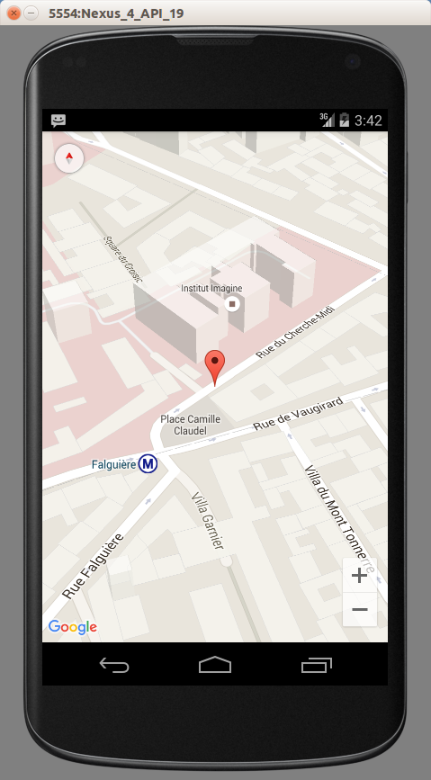

GpsTracker
===================

Welcome to the GPS tracker project with Linux Magazine France #82.

This project will enable you to find your lost phone with Google maps mapping system. You can also perform GPS tracking any system where you can board an android phone. You can remotely monitor the movement of your phone, remote control the GPS system. The project is incremental and presents the development in several versions, until the final version V5. The V6 version is being developed to integrate new features. The entire project is developed with Android Studio, the project is compatible Android 4.xx up to the latest Android 6.0 Marshmallow.

The project is presented in Linux Magazine France HS 82. You can find the magazine at: https://boutique.ed-diamond.com/gnulinux-magazine-hors-series/924-gnulinux-magazine-hs-82.html , Edition Diamond https://boutique.ed-diamond.com/

Thank you for your proposals and reflection on the project.

fredericamps@gmail.com

--------
